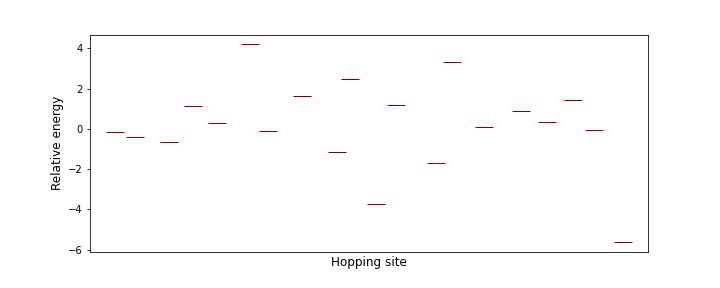
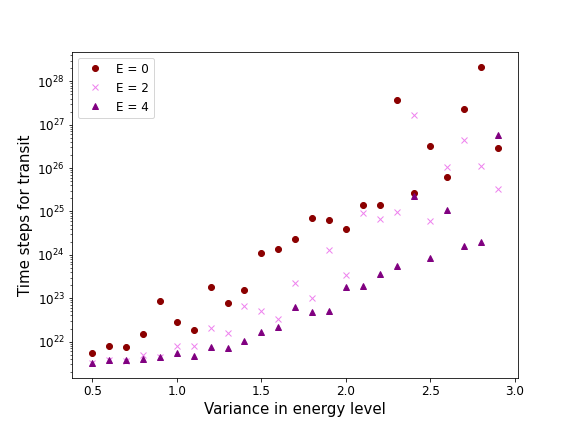
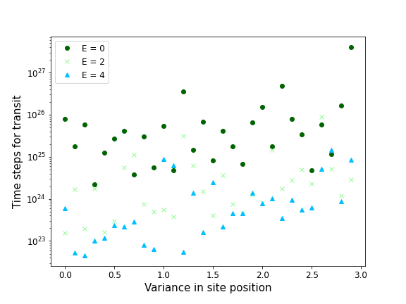
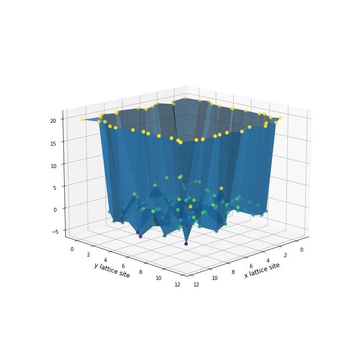
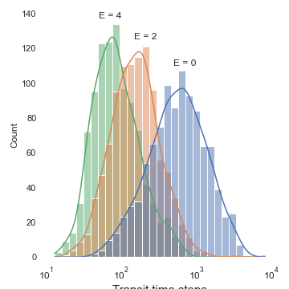

# About this project

Here I am doing some simple modeling that was closely related to a topic from my PhD: charge transport in organic semiconductors. This is set up based on the Gaussian Disorder Model, where the hopping sites have variation in their energy levels and position. 

## 1-D transport

The first case I wanted to investigate is the transport down a 1 dimensional row of hopping sites. The disorder of the energy and positions of these sites can be represented in the figure below:

To model the transport of a charge through this line, I will calculate the hopping rates from one site to the next one using a Miller-Abrahams approach:

If the energy of the next site > energy of the current site:
$$ e^{-(\Delta E)}* e^{-(\Delta D)} $$

Otherwise we only consider the distance of the two sites:
$$ e^{-(\Delta D)} $$

Taking the reciprical of these hopping rates gives an estimate of how many "time steps" it will take for the charge to probabalistically hop from one site to the next. If we add this up as we move down the line then this can give us a measure of the transit time of a charge - how many time steps it takes for a charge to move from the start to the end of the chain. 

In this 1-D model I am only considering the drift (movement due to an electric field) of the charges through these sites.

If we keep the positional variance fixed, but alter the energy disorder and the electric field (E) then we see the following estimation for transit time:

Every point in this graph is the average of 100 'runs' of this calculation.

This provides some interesting fundamental relations:
- Higher electric fields lead to lower transit times - this makes sense, as a high electric field would effectively lower all energy barriers that it faces and make a transition from a lower to higher energy level state faster. 
- Larger amounts of energy level variance/disorder lead to longer transit times - makes sense because larger disorder would allow for the creation of big energetic differences from one state to another, which lowers the probability of hopping and increases the amount of time it will take for the charge to reach the end. 
- In the limit of near-zero energy level variance the transit time will plateau to a value - I think this is because going from higher energy level sites to lower ones is not *accelerated* by the electric field, and this transition is only related to the distance of the two sites. So, as the variance is lowered and we use higher electric fields, we will approach a constant transit time.

Then, if we fix the energetic disorder, we can investigate how the transit time of a charge is related to the site positional variance:

From this we can learn the following:
- Higher electric fields (E) still lead to lower transit times.
- Large positional disorder leads to larger transit times - sites will be more often far away from each other and therefore take longer to hop to the next site.

## 2-D transport

A 2 dimensional grid can be initialized with inherent site position and energy disorder and represented by the figure below:

Around my grid I have made a boundary to act as a wall where the charges cannot hop to (or, rather, it is probabalistically nearly zero to do so).

Within my physical model, all generated charges will be far enough away from any other generated charges so that they do not interact with each other. This means that I can initialise my particle by itself along the x=1 axis (x=0 is where the boundary is) and allow it to hop to the end of my grid.

My plan is to initialise a charge along a site on the x=1 line one at a time, have it be pulled across the grid (in the positive x direction) with an external field, then measure how many time steps it took for that transport to happen. This will be done for every site on the x=1 line and repeated 100 times so we can observe a distribution of transit times.

With every loop I did the following:
1) Given a current positional index (i, j) locate all nearby sites
2) Calculate the hopping rate to each of those sites, based on their energy and position with respect to the current site
3) Multiply the rates in the positive x-direction by a factor greater than 1, and the rates in the negative direction by a factor less than 1, to mimic the effect of drift
4) Randomly select one of the nearby sites to have its rate multiplied by a factor larger than 1 to mimic the effect of diffusion
5) Select the next site to hop to, based on the weighting of their respective weights

Once I know the next hopping site that the particle will go to and its corresponding rate, I can calculate the time this will take and repeat this until I reach the end of my grid (end of the x-axis).

Based on a grid with energetic disorder of 2, and positional disorder of 1, with a square shape of 10x10 sites, I get the following distributions for transit time with varied electric field:

Here the x-axis is labeled 'Transit time steps'.

This gives us the following information:
- Increasing the electric field (E) gives lower transit times - makes physical sense, larger force to pull the charges across the grid should make it traverse it faster