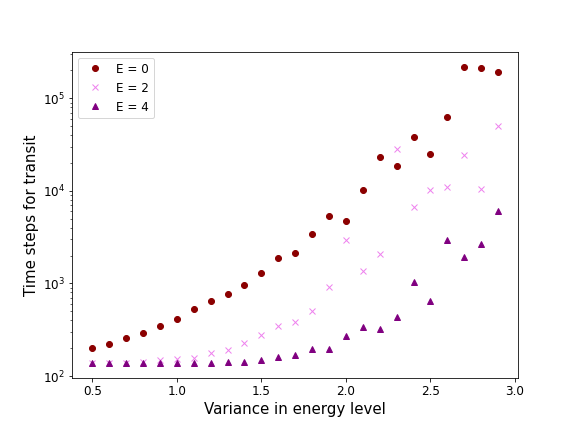
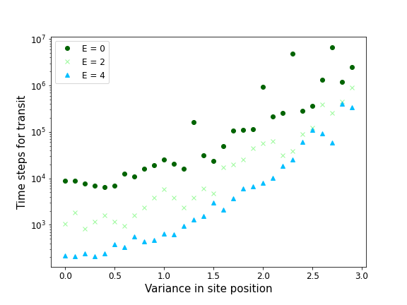
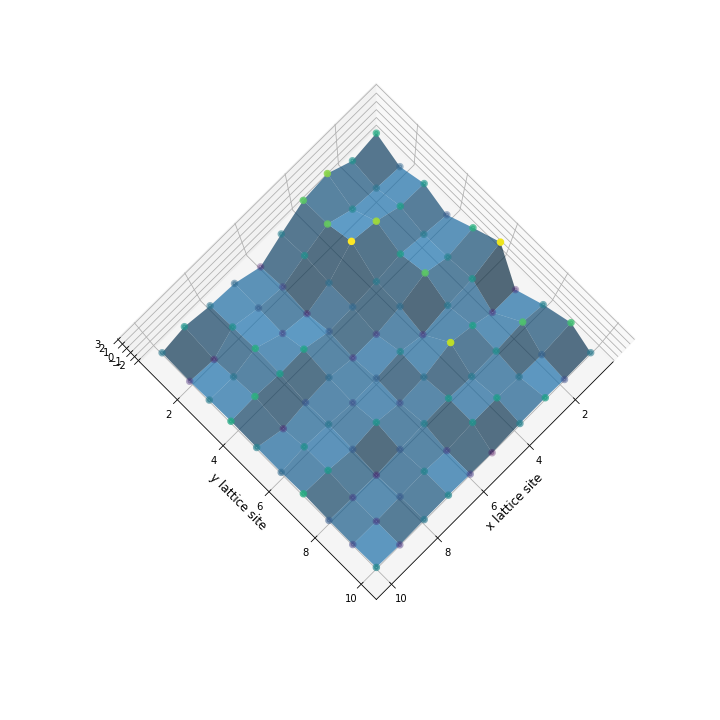

# About this project

Here I am doing some simple modeling that was closely related to a topic from my PhD: charge transport in organic semiconductors. This is set up based on the Gaussian Disorder Model, where the hopping sites have variation in their energy levels and position. 

## 1-D transport

The first case I wanted to investigate is the transport down a 1 dimensional row of hopping sites. The disorder of the energy and positions of these sites can be represented in the figure below:

To model the transport of a charge through this line, I will calculate the hopping rates from one site to the next one using a Miller-Abrahams approach:

If the energy of the next site > energy of the current site:
$$ e^{-(\Delta E)}* e^{-(\Delta D)} $$

Otherwise we only consider the distance of the two sites:
$$ e^{-(\Delta D)} $$

Taking the reciprical of these hopping rates gives an estimate of how many "time steps" it will take for the charge to probabalistically hop from one site to the next. If we add this up as we move down the line then this can give us a measure of the transit time of a charge - how many time steps it takes for a charge to move from the start to the end of the chain. 

In this 1-D model I am only considering the drift (movement due to an electric field) of the charges through these sites.

If we keep the positional variance fixed, but alter the energy disorder and the electric field (E) then we see the following estimation for transit time:

Every point in this graph is the average of 100 'runs' of this calculation.

This provides some interesting fundamental relations:
- Higher electric fields lead to lower transit times - this makes sense, as a high electric field would effectively lower all energy barriers that it faces and make a transition from a lower to higher energy level state faster. 
- Larger amounts of energy level variance/disorder lead to longer transit times - makes sense because larger disorder would allow for the creation of big energetic differences from one state to another, which lowers the probability of hopping and increases the amount of time it will take for the charge to reach the end. 
- In the limit of near-zero energy level variance the transit time will plateau to a value - I think this is because going from higher energy level sites to lower ones is not *accelerated* by the electric field, and this transition is only related to the distance of the two sites. So, as the variance is lowered and we use higher electric fields, we will approach a constant transit time.

Then, if we fix the energetic disorder, we can investigate how the transit time of a charge is related to the site positional variance:

This has a less-distinct relation to the transit time of a charge through the 1-D site chain. However, we can observe the following:
- Higher electric fields (E) still lead to lower transit times.
- Large positional disorder leads to larger transit times, but the linear correlation is quite weak - this could make sense, more disorder could lead to higher distances between sites and therefore increase the transit time

## 2-D transport

A 2 dimensional grid can be initialized with disorder energy and represented by the figure below:

More to come on this project...